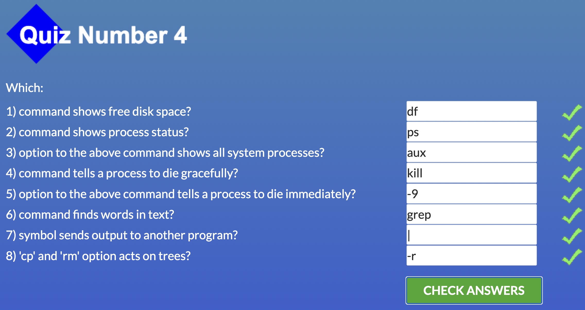
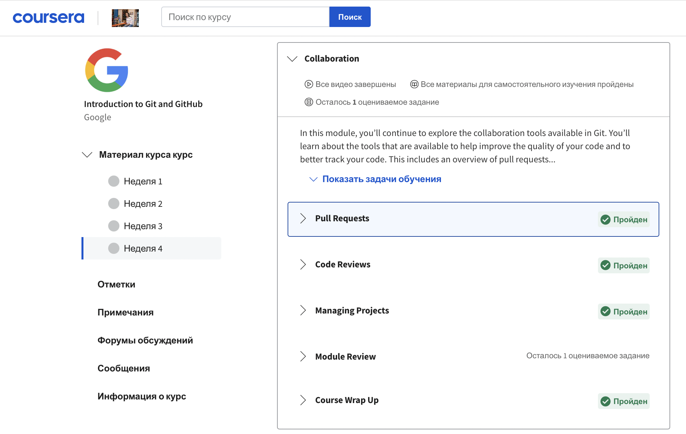

# Stage 0

## General 
- [x] [0. Git Basics](#0-git-basics)
- [x] [1. Linux CLI and Networking](#1-linux-cli-and-networking)
- [x] [2. VCS (hello gitty), GitHub and Collaboration](#2-github-and-collaboration)

## Front-End Basic
- [ ] 1. Intro to HTML & CSS
- [ ] 2. Responsive Web Design
- [ ] 3. HTML & CSS Practice
- [ ] 4. JavaScipt Basics
- [ ] 5. Document Object Model - practice 

## Advansed Topics
- [ ] 1. Building a Tiny JS World (pre-OOP) - practice
- [ ] 2. Object oriented JS - practice
- [ ] 3. OOP exercise - practice
- [ ] 4. Offline Web Applications
- [ ] 5. Memory pair game - real project!
- [ ] 6. Website Perfomance Optimization 
- [ ] 7. Friends APP - real project!

## 0. Git Basics

I had never studied information about Git та GitHub before, so this course was completely new to me. Frankly speaking, it was not very easy for me,        and took some time to understand and start to apply in practice tasks.
  
[Learn Git Branching](https://learngitbranching.js.org/?locale=uk)  was help me to see visualize branches, commits and how to work with it on a basic       level. All of commands was a new for me, such a `git status` or `git add` and others. I was surprised how easily can see summarized view of the commit history for a repo with a command `git log --graph --oneline`. 

Completed 1-2 week of course of [Introduction to Git and GitHub](https://www.coursera.org/learn/introduction-git-github/home/week/1): 
 

1 week

 

  

2 week

  
Completed [Learn Git Branching](https://learngitbranching.js.org/?locale=uk): 
  

Основи: Introduction Sequence

  

  

Віддалені репозиторії: Push & Pull – віддалені репозиторії в Git!

## 1. Linux CLI and Networking

Скріншоти

 
 
 
 
  

До перегляду модулів [Linux Survival](https://linuxsurvival.com](https://linuxsurvival.com/)) майже не володів інформацією стосовно базових команд Linux. Краєм вуха чув про `cd` `mkdir`, а також закріпив знання про команди, котрі були в попередньому завданні Git Basics. Корисною була порада відкривати папку одразу в терміналі завдяки `Git Bash Here`. Ознайомившись із командами в [Linux Survival](https://linuxsurvival.com/) намагався одразу їх закріпити на практиці у командному рядку. Гадаю, що команди із квізу 1-2 будуть використовуватися доволі часто при роботі з git.

Статті про HTTP дали уявлення про роботу даного протоколу, відкрив для себе, що основоположними «китами» є URL-адреси, методи та коди стану. Дізнався про різницю між ідентифікацією (за допомогою ІР-адреси клієнта, FAT URL, заголовків запиту та кукі), авторизацією (найкращий спосіб ідентифікації користувача за допомогою технології на зразок OAuth) та автентифікацією (Basic чи Digest Authentification, перша є одразу реалізована в протоколі HTTP). Корисним було побачити розгорнутий список помилок, які можуть виникнути під час створення запитів до серверу (не тільки помилка 404 чи 505). Цікаво було дізнатися, що для того, щоб існуючий веб-додаток перевести на протокол HTTPS потрібно створити цифровий сертифікат для забезпечення конфіденційного звʼязку.

## 2. GitHub and Collaboration

Проглянув 3-4 тиждень курсу [Introduction to Git and GitHub](https://www.coursera.org/learn/introduction-git-github/home/week/3): 

3 тиждень

 

  

4 тиждень

Прослухавши [Coursera: вступ до Git і GitHub](https://www.coursera.org/learn/introduction-git-github/home/week/3) детальніше ознайомився із [GitHub](https://github.com/). Побачив на практиці роботу із репозиторієм. Цікаво було побачити, як зробити історію комітів лінійною та видалити локальну та віддалену гілки за допомогою команд `git push --delete origin (назва гілки)` та `git branch -d (назва гілки)`

**Ознайомився із твердженнями щодо найкращої практики співпраці:**
- працюючи над великою зміною є сенс в тому, щоб мати окрему гілку виокремлену для неї;
- завжди синхронізувати свої гілки, перш ніж починати будь-яку роботу самостійно;
- уникати дуже великих змін, які змінюють багато різних речей.

Було цікаво наочно побачити як за допомогою командного рядка та GitHub виконується Pull Request. Цього не вистачало при виконанні завдання із пункту Git Basics =)

Отримав знання про Squash та Fixup використовуючи команду `git rebase -i`. Дізнався що "Squash" поєднує повідомлення комітів в одне. "Fixup" зберігає оригінальний текст повідомлення, але відкидає нове повідомлення з коміту fixup.

Сподобалася реалізація коментарів при code review. Гадаю, що з цим доводлі часто буду стикатися в навчанні та практиці.
**Відкрив для себе найпоширеніші проблеми із кодом, які можна уникнути завдяки code review:**
- використання незрозумілих назв;
- забутися опрацювати/врахувати певну умову;
- забутися додати тести.

Виконав завдання із [Learn Git Branching](https://learngitbranching.js.org/?locale=uk): 
  

Основи: Переміщуємо роботу туди-сюди

  

  

Віддалені репозиторії: Через origin – до зірок. Прогресивне використання Git Remotes

